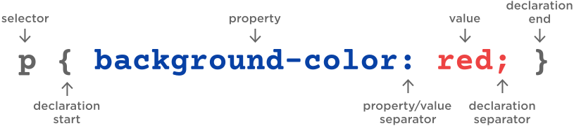

# CSS

**HTML** is the content of your website. The analogy would be HTML is how many rooms you have, how many floors in your house.

**CSS** is the presentation of you website. Continuing the analogy CSS would be the size and apperance of the room. Whether you had rich corinthian leather barbie themed floors.

CSS stands for cascading style sheet and it allows you to manipulate your HTML. Below you can see the basic structure of CSS. The important concept to understand is the selector. The selector selects an HTML element. 

Copy the below text into the CSS tab in codepen, what happens?



Just like HTML elements there are a lot of different CSS properties that can be appliead. Luckily MDN can help us out again. [Click Here](https://developer.mozilla.org/en-US/docs/Web/CSS/Reference) and scroll down to see the different properties that can be applied. Spend some time implementing different **properties** and **values**. You are able to write multiple properties for each selector - see below for an example.
```
p {
   color: black;
   font-size: 24px;
   font-style: italic;
   font-weight: bold;
   letter-spacing: 2px;
   line-height: 1.5;
   text-align: center;
   text-decoration: underline;
   text-transform: uppercase;
   word-spacing: 15px;
}
```

Can you change the text of the headings element?